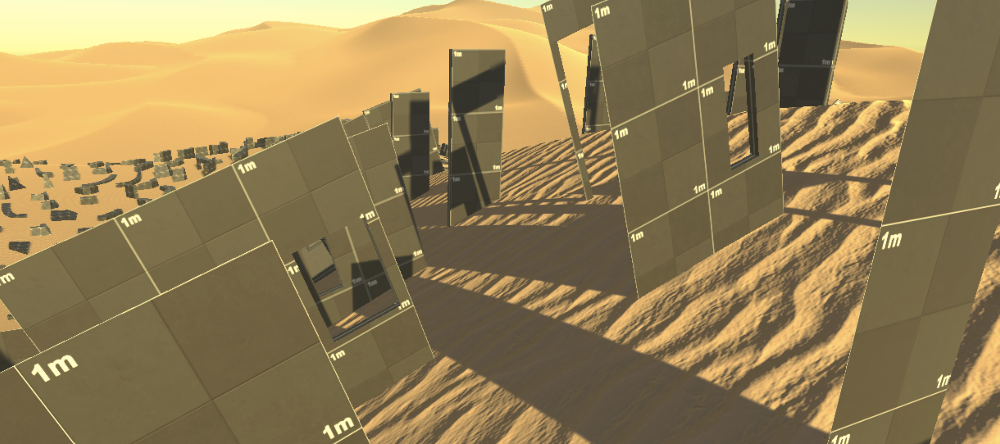

---
# Feel free to add content and custom Front Matter to this file.
# To modify the layout, see https://jekyllrb.com/docs/themes/#overriding-theme-defaults

layout: home

---

A project aimed at developing an approach to research-creation with a focus on recoverability, notably via the Method for Design Materialization (MDM).

### [Who are we?]({{ "people" | relative_url }})

### [What is the MDM?]({{ "mdm" | relative_url }})

### [Can I see some examples?]({{ "examples" | relative_url }})

### [What should I read?]({{ "bibliography" | relative_url }})
