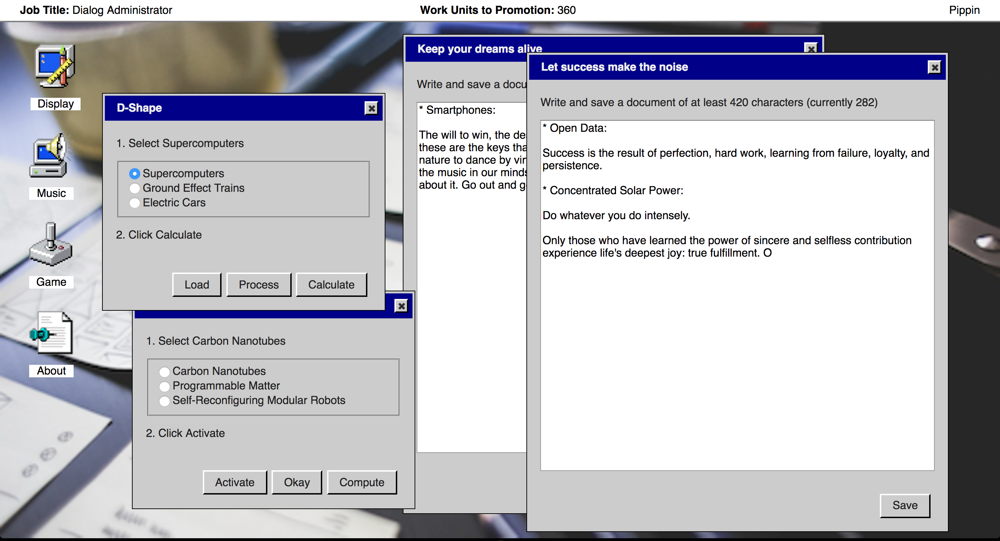
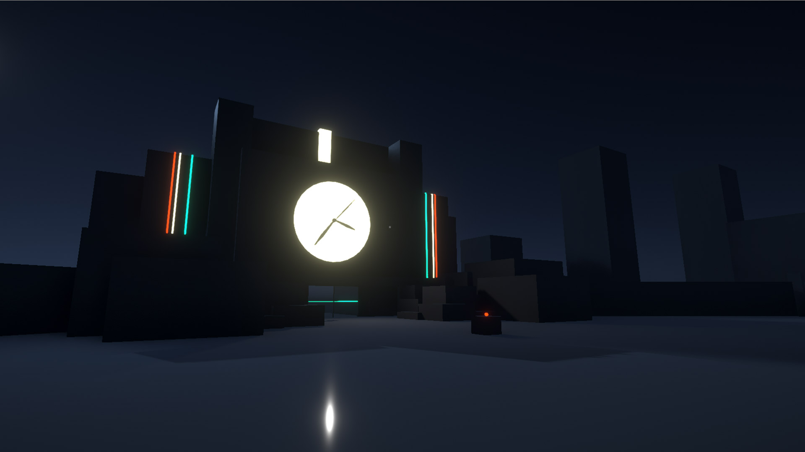

---
# Feel free to add content and custom Front Matter to this file.
# To modify the layout, see https://jekyllrb.com/docs/themes/#overriding-theme-defaults

layout: page
title: "Games as Research Research-Creation Support Material"

---

# Games as Research Research-Creation Support Material

## _It is as if you were doing work_, by Pippin Barr (2017)

A speculative videogame exploring a post-work future for humans. We include it here because it represents a key piloting of the research-creation methodology discussed in this proposal. Specifically, reviewers will be able to see the code history and process materials repository of the game and thus be able to see the extent of information capture possible with the method proposed. We suggest reviewers briefly explore the game and its documentation as follows:

[Play _It is as if you were doing work_ online in your browser](https://pippinbarr.github.io/itisasifyouweredoingwork/) (compatible with all major desktop browser, not mobile-friendly)

[View the _It is as if you were doing work_ source code history](https://github.com/pippinbarr/itisasifyouweredoingwork/commits/master)

[Browse the _It is as if you were doing work_ core process documentation](https://github.com/pippinbarr/itisasifyouweredoingwork/blob/master/process/README.md)

A screenshot of _It is as if you were doing work_ during play.

If reviewers do not feel comfortable trying out the game, we are providing this [trailer for _It is as if you were doing work_](https://www.youtube.com/embed/RDMiRiHcezI), including footage of gameplay.

---

## Documenting Trajectories in Design Space: a Methodology for Applied Game Design Research, by Rilla Khaled, Jonathan Lessard, and Pippin Barr (2018)

This is a paper written about the research-creation method discussed in this grant application. We direct reviewers’ attention specifically to the section "A Design Process Analysis of _It is as if you were doing work_" beginning on page five in which a design analysis is carried out based on the data gathered in the _It is as if you were doing work_ repository above. In this way, reviewers will gain some sense of the analytical possibilities generated by the research-creation design documentation methodology.

Citation:  
Khaled, R., Lessard, J., and Barr, P. Documenting Trajectories in Design Space: A Methodology for Applied Game Design Research. In the Proceedings of Foundations of Digital Games (FDG) 2018. 2018.

[Read the most current version of the paper here](fdg-2018-documenting-trajectories-in-design-space.pdf) (PDF)

---

## _Untitled Project_, by Charles Doucet

A videogame developed by Charles Doucet, an undergraduate student in the Department of Design and Computation Arts, under the supervision of Pippin Barr. The videogame concerns an design exploration of the possibilities of being able to stop time within a first-person videogame environment and Charles is following the current version of our documentation methodology as he works on the project.

[View the _Untitled Project_ source code history](https://github.com/charlesDouc/Independent-Study)

[Browse the _Untitled Project_ core process documentation](https://github.com/charlesDouc/Independent-Study/wiki)

A screenshot of _Untitled Project_ during play.
