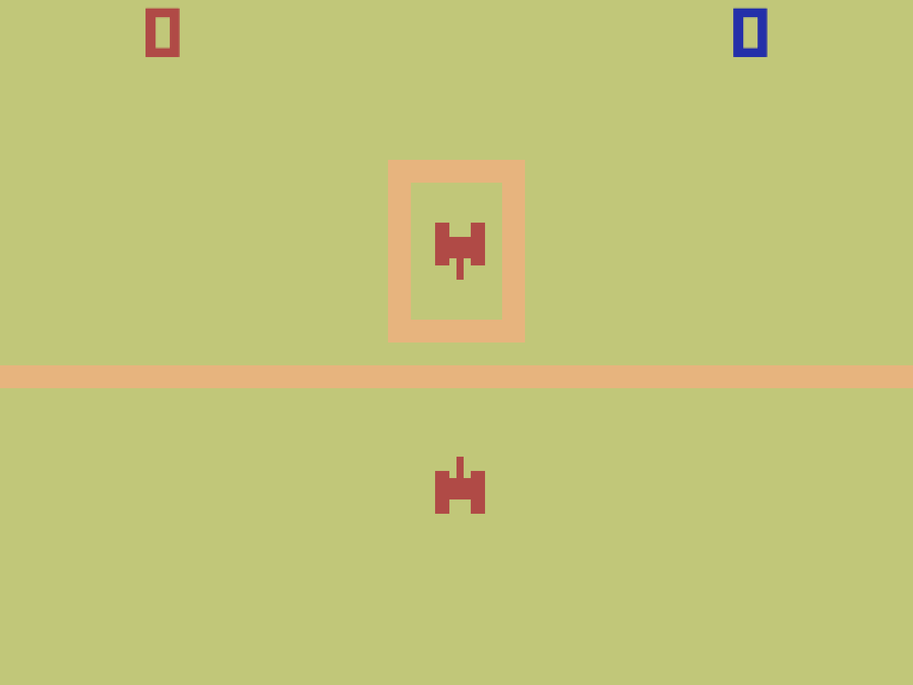

---
# Feel free to add content and custom Front Matter to this file.
# To modify the layout, see https://jekyllrb.com/docs/themes/#overriding-theme-defaults

layout: page
title: "Research-Creation Support Material"

---

## *Combat at the Movies*, by Pippin Barr (2020)

A videogame exploring the possibility space of highly constrained cinematic adaptation. Classic works of cinema, such as *Citizen Kane* are adapted into the videogame design language of a classic tank-combat game, *Combat* (1977) from Atari.

We include this game because it represents a key data-point for the MDM research-creation methodology discussed in this grant application. Specifically, reviewers will be able to see the code history and process materials repository of the game and thus be able to see the extent of information capture possible with the method proposed. We suggest reviewers briefly explore the game and its documentation as follows:

[Play the game online in your web browser](https://pippinbarr.github.io/combat-at-the-movies/) (compatible with all major desktop browsers, not mobile-friendly)

[Explore the source code history](https://github.com/pippinbarr/combat-at-the-movies/commits/master)

[Browse the process documentation](https://pippinbarr.github.io/combat-at-the-movies/process/)

  
A screenshot of the *Taxi Driver* adaptation from *Combat at the Movies*.

---

## Documenting Trajectories in Design Space: a Methodology for Applied Game Design Research, by Rilla Khaled, Jonathan Lessard, and Pippin Barr (2018)

This is a paper written about the research-creation method discussed in this grant application. We direct reviewers’ attention specifically to the section "A Design Process Analysis of *It is as if you were doing work*" beginning on page five in which a design analysis is carried out based on the data gathered in the [*It is as if you were doing work* repository](https://github.com/pippinbarr/itisasifyouweredoingwork). In this way, reviewers will gain some sense of the analytical possibilities generated by the research-creation design documentation methodology.

Citation:  
Khaled, R., Lessard, J., and Barr, P. Documenting Trajectories in Design Space: A Methodology for Applied Game Design Research. In the Proceedings of Foundations of Digital Games (FDG) 2018. 2018.

[Read the paper here](assets/pdfs/fdg-2018-documenting-trajectories-in-design-space.pdf) (PDF)

---

## Student work

Below we link to student work at the undergraduate, Master's, and Ph.D. levels using the documentation methodology proposed in this grant application. We include these examples to demonstrate how the approach can be a critical pedagogical approach in design education, as well as a way for graduate students to be accountable about their research-creation work and to be able to recover insights gained in process.

### Undergraduate: [V00717 by Sylvain Tran](https://github.com/SylvainTran/V00717)

Sylvain is an undergraduate student in Design and Computation Arts at Concordia University. This speculative design project was produced under Dr. Barr's supervision and shows how the methodology approach can draw consistent insight even from first-cycle students.

### Master's: [Franklin Ford Bot by Cyrus Lognonné](https://github.com/cyruslk/franklin-ford-bot/blob/master/logs.md)

Cyrus was an M.Des. student supervised by Dr. Barr. He was introduced to the MDM documentation approach during his Master's but deployed it in this example for a research project as an RA for [@FRANKLINFORDBOT](https://www.franklinford.org/#about), a SSHRC-funded project with Juliette De Maeyer and Dominique Trudel. Here we see Cyrus using the method to exhaustively document his design and technical insights.

### Ph.D.: [How Not to Use a Phone by Enric Llagostera](https://enricllagostera.github.io/how-not-to-use-a-phone/)

Enric is a Ph.D. candidate working in the TAG research centre under the supervision of Dr. Khaled. His work focuses on experimental uses of physical devices for controlling videogames, and has been heavily informed in recent years by the use of the MDM documentation approach. The above project, and it's outcomes [Sensing Gestures](https://github.com/enricllagostera/SensingGestures), [Shellphone](https://github.com/enricllagostera/Shellphone), and [RedDirt](https://github.com/enricllagostera/RedDirt) collectively model how advanced graduate students can benefit from this rigorous design research documentation method.
